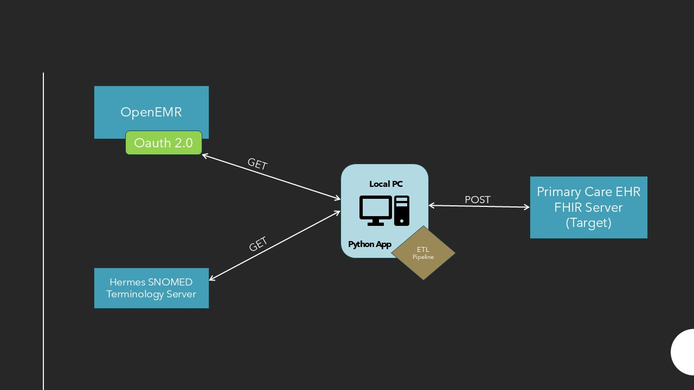

# ETL Project

---

[Home](index.md) | [Team Contributions](team_contributions.md) | [ETL Pipeline](etl_pipeline.md) | [Insights](insights.md)| [Presentation](presentation.md) | [Github Project Repo](https://github.iu.edu/mahigogu/FA25_B581_Final_Project_OpenEMR_mahitha_gogu)

---

## System Architecture

---

# Introduction

Modern healthcare organizations manage vast amounts of clinical information—ranging from patient demographics to medical conditions, diagnostic results, and treatment procedures. These data often originate from different systems and formats, creating challenges for interoperability and clinical decision support.

This project addresses these challenges by developing a streamlined ETL (Extract, Transform, Load) pipeline specifically tailored for healthcare data. The goal is to reliably collect information from the OpenEMR FHIR server, standardize it using medical terminology systems, and load enriched records into a Primary Care EHR. By ensuring that critical patient information is consistent and readily accessible, the pipeline enhances clinical workflows, supports evidence-based decision-making, and ultimately contributes to improved patient care.

---

# Purpose of the ETL Pipeline

The purpose of this ETL pipeline is to automate the movement and transformation of healthcare data between disparate systems while ensuring strict adherence to interoperability standards. The pipeline is designed to:

- Retrieve clinical resources (e.g., patients, conditions, observations) directly from a FHIR-compliant source  
- Normalize and classify data using SNOMED CT hierarchies and other clinical coding systems  
- Deliver structured, standardized data to a Primary Care EHR in a usable and validated form  

This standardized approach supports:

- More reliable clinical decision-making  
- Better continuity of care  
- Reduction of manual data entry  
- Stronger analytics capabilities for operational and quality-improvement initiatives  

By automating much of the data handling process, the pipeline improves accuracy, enhances system interoperability, and reduces administrative burden.

---

# Key Tools and Technologies

### Python  
Used to implement the full ETL workflow, including API calls, Extracting, Loading and Transforming data, loading JSON data and updating it.

### FHIR API  
Provides a standardized, interoperable format for healthcare data exchange. The pipeline interacts with multiple FHIR resources such as Patient, Condition, Procedure, and Observation.

### Hermes Terminology Server (SNOMED CT)  
Enables terminology lookups—including parent and child concept retrieval and ICD-10 mapping—ensuring clinically meaningful data transformation.

### Primary Care EHR FHIR Server  
Serves as the destination system where transformed and enriched clinical records are loaded.

### HL7 v2 (for Task 5)  
Used to demonstrate legacy interoperability by translating FHIR resources into an ADT-A01 HL7 message.

---

# Summary of Deliverables

### End-to-End ETL Pipeline  
A complete implementation that extracts data from OpenEMR, transforms it using clinical terminology rules, and loads it into a Primary Care EHR.

### FHIR API Integration  
The project demonstrates robust interaction with multiple FHIR endpoints, handling authentication, filtered searches, and resource creation.

### Clinical Record Consolidation  
Conditions, observations, and procedures extracted from OpenEMR are standardized and integrated into a unified patient chart in the Primary Care EHR.

### HL7 v2 Interoperability Module  
An ADT message generator converts FHIR patient and condition data into an HL7 v2 format, showcasing compatibility with legacy healthcare systems.

### Project Website  
This GitHub Pages site documents the ETL workflow, coding tasks, system diagrams, insights, and team contributions in a clear and professional format.

---

# Next Steps

Navigate to the **ETL Pipeline** page to explore the technical implementation of each coding task, including extraction logic, SNOMED transformations, and loading workflows.

