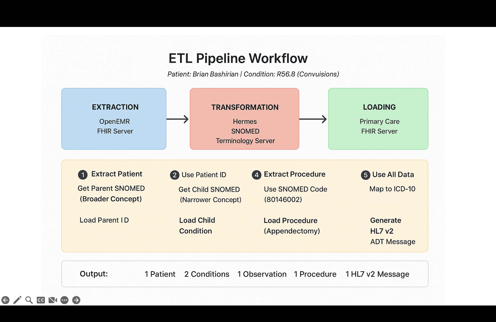
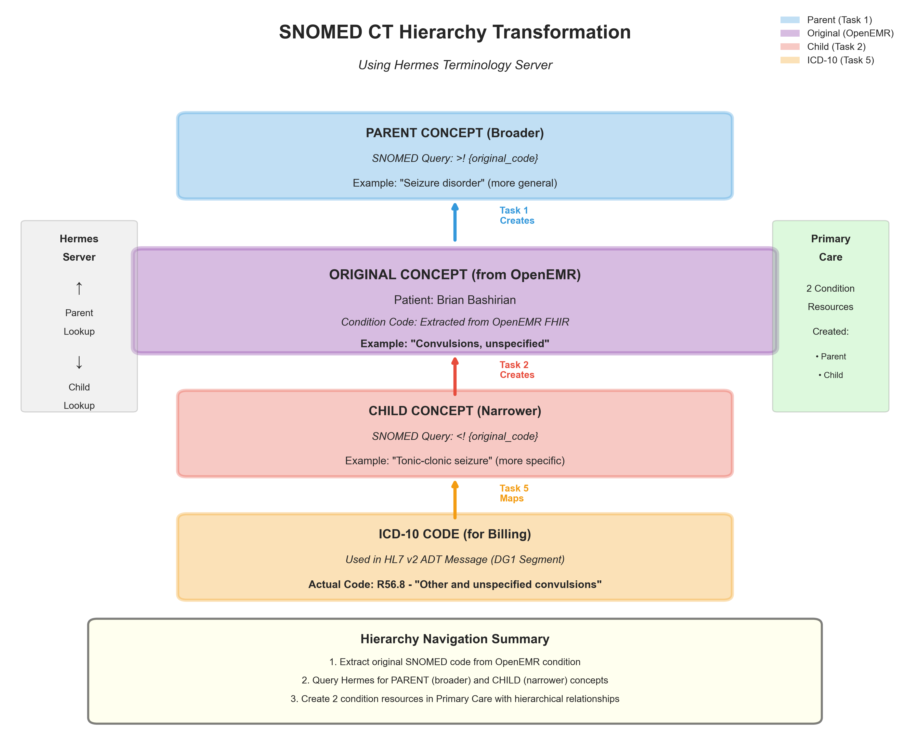
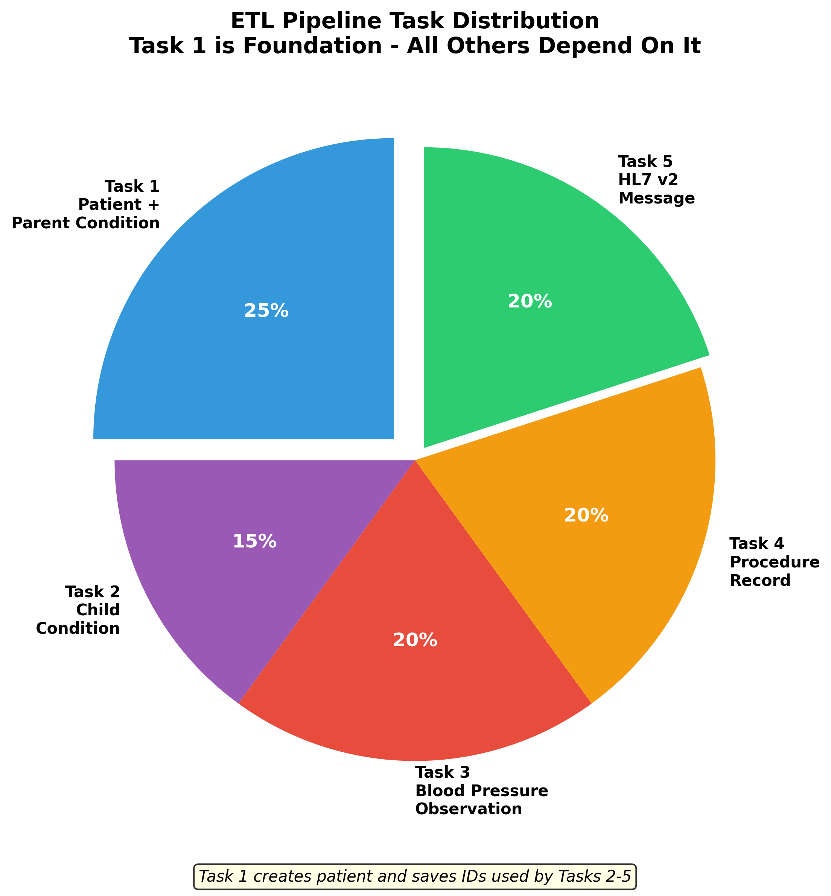
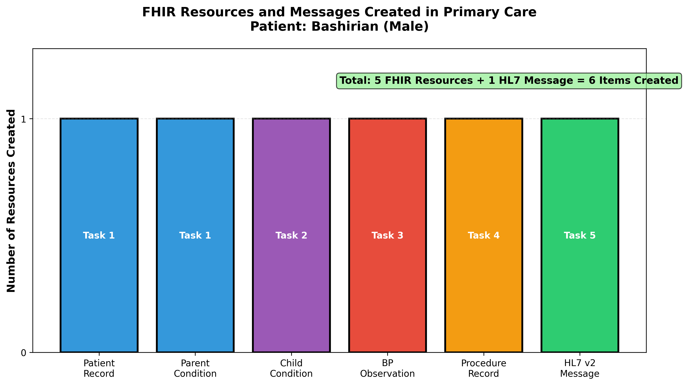
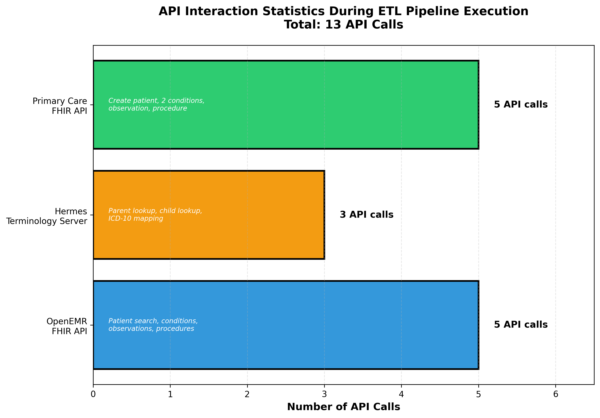

[Home](index.md) | [Team Contributions](team_contributions.md) | [ETL Pipeline](etl_pipeline.md) | [Insights](insights.md) | [Presentation](presentation.md) | [Github Project Repo](https://github.iu.edu/mahigogu/FA25_B581_Final_Project_OpenEMR_mahitha_gogu)

---

## Overview

This page presents key insights derived from building our ETL pipeline that transfers patient data from OpenEMR FHIR server to Primary Care FHIR server using the Hermes SNOMED CT terminology server.

**Test Patient:** Brian Bashirian (Male)  
**Patient DOB:** September 30, 1982  
**Condition:** R56.8 - Other and unspecified convulsions  
**Procedure:** Appendectomy (SNOMED: 80146002)  
**Blood Pressure:** 120/60 mmHg (Normal)  
**Total Resources Created:** 6 FHIR resources + 1 HL7 v2 message

---

## ETL Pipeline Workflow



**Figure 1:** Complete ETL pipeline showing data extraction from OpenEMR, transformation using Hermes terminology server, and loading to Primary Care FHIR server. The five tasks are executed sequentially with Task 1 serving as the foundation for all subsequent tasks.

---

## Key Insight 1: FHIR Search Parameters Enable Efficient Data Retrieval

We used FHIR search parameters to filter and retrieve specific patient data from OpenEMR:

```python
# Task 1: Search with name and gender parameters
patients_data = get_patients(name="Bashirian", gender="male")
```

This approach returned only the relevant patient (Brian Bashirian) instead of querying all patients in the system. FHIR's standardized search parameters (name, gender, birthdate, condition) make data extraction efficient and precise.

**Lesson Learned:** FHIR search parameters are essential for building scalable ETL pipelines that work with large healthcare databases.

---

## Key Insight 2: SNOMED CT Hierarchy Enables Clinical Data Transformation

Our pipeline leveraged SNOMED CT's hierarchical structure to transform medical concepts:



**Figure 2:** SNOMED CT hierarchy showing how one condition code (R56.8 - Convulsions) can be transformed into parent (broader) and child (narrower) concepts using Hermes terminology server lookups, and ultimately mapped to ICD-10 for billing purposes.

- **Parent Terms** (Task 1): Broader clinical concepts (e.g., "Seizure disorder" from "Convulsions")
- **Child Terms** (Task 2): More specific diagnoses (e.g., "Tonic-clonic seizure" from "Convulsions")
- **ICD-10 Mapping** (Task 5): Billing codes required for insurance claims (R56.8)

**Challenge Faced:** Not all SNOMED codes had parent or child terms available. We implemented loop logic to iterate through multiple conditions until finding valid hierarchical relationships.

**Lesson Learned:** Terminology servers like Hermes are critical for navigating medical code systems and enabling semantic interoperability.

---

## Data Quality Challenges

Real-world healthcare data is incomplete.

**Solution:** Implemented defensive coding with default values:

```python
"line": addr.get("line", "Not Available"),
"city": addr.get("city", "Not Available"),
"state": addr.get("state", "Not Available")
```

This prevented the pipeline from crashing when encountering missing data while maintaining data integrity.

---

## Task Distribution and Dependencies



**Figure 4:** Distribution of the five ETL tasks showing Task 1 as the foundation. Tasks 2-5 all depend on patient IDs and SNOMED codes saved by Task 1.

All subsequent tasks relied on data saved from Task 1:
- **Patient IDs** (both OpenEMR and Primary Care)
- **SNOMED codes** from conditions
- **Patient demographics** for HL7 message generation

**Implementation:** We saved these values to `new_primary_care_patient_id.txt` to enable task reusability without redundant API calls.

---

## Resources Created by Task



**Figure 5:** Bar chart showing FHIR resources and HL7 messages created across all five tasks for patient Brian Bashirian.

| Task | Resource Type | SNOMED/ICD Code | Purpose |
|------|--------------|-----------------|---------|
| Task 1 | Patient + Condition (Parent) | Parent SNOMED | Foundation - creates patient record |
| Task 2 | Condition (Child) | Child SNOMED | More specific diagnosis |
| Task 3 | Observation (BP) | LOINC codes (85354-9, 8480-6, 8462-4) | Vital signs monitoring (120/80 mmHg) |
| Task 4 | Procedure | SNOMED 80146002 | Appendectomy procedure |
| Task 5 | HL7 v2 ADT Message | ICD-10 R56.8 | Legacy system interoperability |

---

## API Interaction Statistics



**Figure 6:** Breakdown of API calls made during the ETL pipeline execution showing interactions with OpenEMR, Hermes, and Primary Care servers.

Our pipeline made approximately:
- **5 OpenEMR API calls** (patient search, 2 conditions, observations, procedures)
- **3 Hermes API calls** (parent lookup, child lookup, ICD-10 mapping)
- **5 Primary Care API calls** (create patient, 2 conditions, observation, procedure)

**Performance Note:** Hermes terminology lookups were the slowest operations due to complex SNOMED CT queries and network latency.

---

## Best Practices We Followed

- Used FHIR search parameters to filter data directly from the source.

- Added error handling using .get() methods and default values.

- Saved intermediate results like patient IDs and SNOMED codes for reuse.

- Created JSON templates to build complex FHIR resources efficiently.

- Automated the pipeline to generate both FHIR and HL7 v2 formats for interoperability.


## Conclusion

- Built an ETL pipeline integrating data across OpenEMR, Hermes, and Primary Care systems.

- Used FHIR APIs effectively for patient search and clinical data extraction.

- Applied terminology standards like SNOMED CT and ICD-10 for accurate clinical mapping.

- Handled real-world data quality issues through strong validation and error handling.

- Enabled interoperability across modern (FHIR JSON) and legacy (HL7 v2) formats.

---

*ETL Pipeline: OpenEMR → Hermes → Primary Care FHIR Server*  
*Test Patient: Brian Bashirian (Male, DOB: 1982-09-30)*  
*Condition: R56.8 - Other and unspecified convulsions*  
*Procedure: Appendectomy | Blood Pressure: 120/80 mmHg*

---

## Visualizations Summary

All visualizations were generated using Python with `matplotlib` library:

1. **Figure 1:** ETL workflow diagram showing end-to-end pipeline with all five tasks
2. **Figure 2:** SNOMED CT hierarchy transformation illustration with parent/child relationships
3. **Figure 3:** Data quality issues in source system
4. **Figure 4:** Task distribution and dependencies
5. **Figure 5:** Resources created by task type
6. **Figure 6:** API interaction statistics
