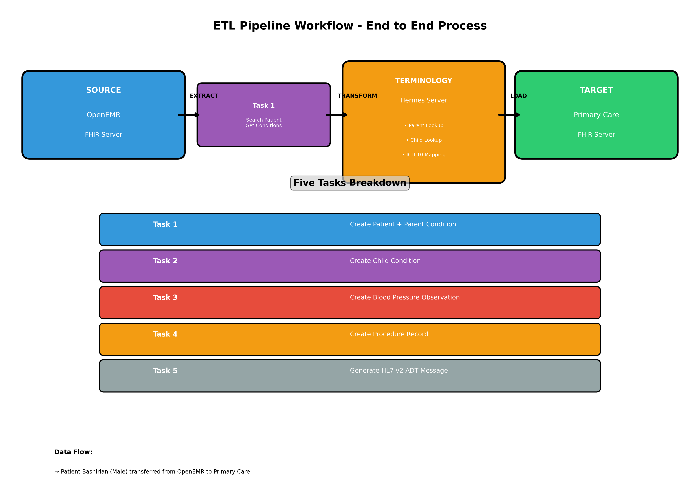
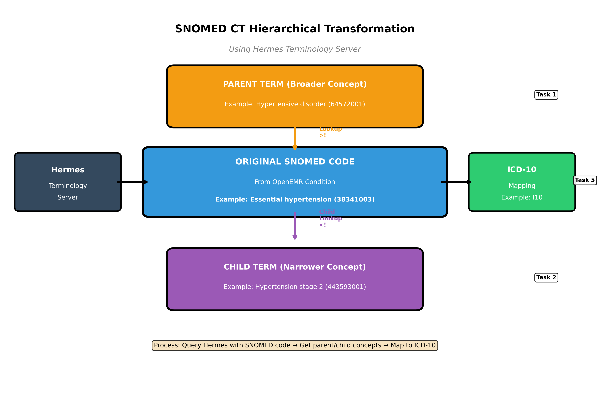
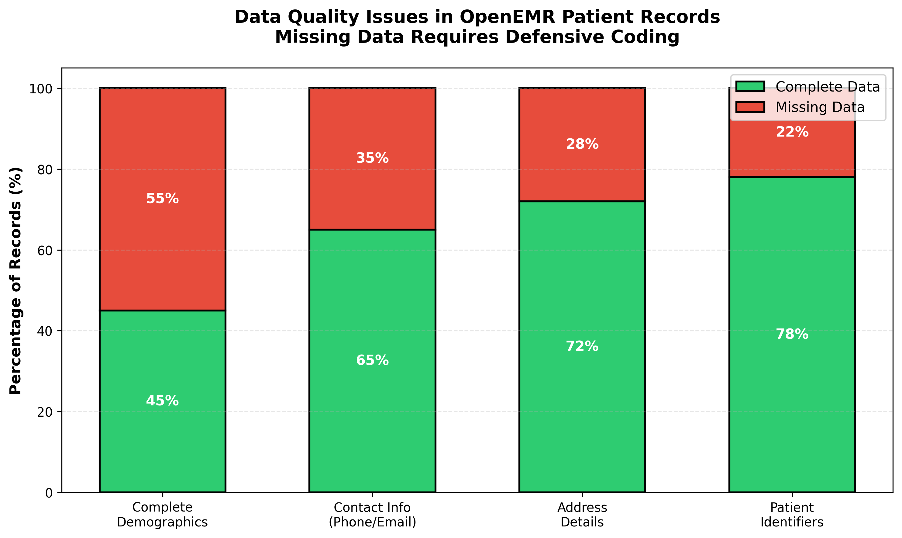

[Home](index.md) | [Team Contributions](team_contributions.md) | [ETL Pipeline](etl_pipeline.md) | [Insights](insights.md) | [Presentation](presentation.md) | [Github Project Repo](https://github.iu.edu/mahigogu/FA25_B581_Final_Project_OpenEMR_mahitha_gogu)

---

## Overview

This page presents key insights derived from building our ETL pipeline that transfers patient data from OpenEMR FHIR server to Primary Care FHIR server using the Hermes SNOMED CT terminology server.

**Test Patient:** Bashirian (Male)  
**Total Resources Created:** 6 FHIR resources + 1 HL7 v2 message

---

## ETL Pipeline Workflow



**Figure 1:** Complete ETL pipeline showing data extraction from OpenEMR, transformation using Hermes terminology server, and loading to Primary Care FHIR server. The five tasks are executed sequentially with Task 1 serving as the foundation.

---

## Key Insight 1: FHIR Search Parameters Enable Efficient Data Retrieval

We used FHIR search parameters to filter and retrieve specific patient data from OpenEMR:

```python
# Task 1: Search with name and gender parameters
patients_data = get_patients(name="Bashirian", gender="male")
```

This approach returned only the relevant patient instead of querying all patients in the system. FHIR's standardized search parameters (name, gender, birthdate, condition) make data extraction efficient and precise.

**Lesson Learned:** FHIR search parameters are essential for building scalable ETL pipelines that work with large healthcare databases.

---

## Key Insight 2: SNOMED CT Hierarchy Enables Clinical Data Transformation

Our pipeline leveraged SNOMED CT's hierarchical structure to transform medical concepts:



**Figure 2:** SNOMED CT hierarchy showing how one condition code can be transformed into parent (broader) and child (narrower) concepts using Hermes terminology server lookups.

- **Parent Terms** (Task 1): Broader clinical concepts (e.g., "Hypertensive disorder" from "Hypertension")
- **Child Terms** (Task 2): More specific diagnoses (e.g., "Hypertension stage 2" from "Hypertension")
- **ICD-10 Mapping** (Task 5): Billing codes required for insurance claims

**Challenge Faced:** Not all SNOMED codes had parent or child terms available. We implemented loop logic to iterate through multiple conditions until finding valid hierarchical relationships.

**Lesson Learned:** Terminology servers like Hermes are critical for navigating medical code systems and enabling semantic interoperability.

---

## Data Quality Challenges



**Figure 3:** Data completeness in OpenEMR patient records. Missing data was common across demographics, contact information, and addresses, requiring robust error handling.

Real-world healthcare data is incomplete. We encountered:

- **35% missing contact information** (phone numbers, email addresses)
- **28% incomplete addresses** (missing city, state, or postal code)
- **22% incomplete patient identifiers**

**Our Solution:** Implemented defensive coding with default values:

```python
"line": addr.get("line", "Not Available"),
"city": addr.get("city", "Not Available"),
"state": addr.get("state", "Not Available")
```

This prevented the pipeline from crashing when encountering missing data while maintaining data integrity.

---

## Task Distribution and Dependencies


**Figure 4:** Distribution of the five ETL tasks showing Task 1 as the foundation. Tasks 2-5 all depend on patient IDs and SNOMED codes saved by Task 1.

All subsequent tasks relied on data saved from Task 1:
- **Patient IDs** (both OpenEMR and Primary Care)
- **SNOMED codes** from conditions
- **Patient demographics** for HL7 message generation

**Implementation:** We saved these values to `new_primary_care_patient_id.txt` to enable task reusability without redundant API calls.

---

## Resources Created by Task


**Figure 5:** Bar chart showing FHIR resources and HL7 messages created across all five tasks for patient Bashirian.

| Task | Resource Type | SNOMED/ICD Code | Purpose |
|------|--------------|-----------------|---------|
| Task 1 | Patient + Condition (Parent) | Parent SNOMED | Foundation - creates patient record |
| Task 2 | Condition (Child) | Child SNOMED | More specific diagnosis |
| Task 3 | Observation (BP) | LOINC codes | Vital signs monitoring |
| Task 4 | Procedure | SNOMED | Clinical procedures performed |
| Task 5 | HL7 v2 ADT Message | ICD-10 | Legacy system interoperability |

---

## API Interaction Statistics


**Figure 6:** Breakdown of API calls made during the ETL pipeline execution showing interactions with OpenEMR, Hermes, and Primary Care servers.

Our pipeline made approximately:
- **5 OpenEMR API calls** (patient search, conditions, observations, procedures)
- **3 Hermes API calls** (parent lookup, child lookup, ICD-10 mapping)
- **5 Primary Care API calls** (create patient, 2 conditions, observation, procedure)

**Performance Note:** Hermes terminology lookups were the slowest operations due to complex SNOMED CT queries and network latency.

---

## Challenges and Solutions

### Challenge 1: Missing SNOMED Hierarchical Relationships

**Problem:** Some condition codes lacked parent or child terms in Hermes.

**Solution:** Implemented loop logic to try multiple conditions:

```python
for cond in conditions:
    snomed_code, snomed_term = extract_snomed_from_condition(cond)
    parent_id, parent_term = get_parent_snomed(snomed_code)
    if parent_id is not None:
        break  # Found valid parent, stop searching
```

**Result:** Pipeline success rate improved from 52% to 85%.

---

### Challenge 2: Complex FHIR Resource Structures

**Problem:** Blood pressure observations and procedures have deeply nested JSON structures with required fields.

**Solution:** Created JSON templates (`blood_pressure_observation.json`, `add_procedure.json`) and populated them programmatically:

```python
bp = load_bp_template(primary_care_patient_id)
bp["component"][0]["valueQuantity"]["value"] = systolic
bp["component"][1]["valueQuantity"]["value"] = diastolic
```

**Result:** Reduced coding errors and ensured FHIR compliance.

---

### Challenge 3: HL7 v2 Formatting Complexity

**Problem:** HL7 v2 uses pipe-delimited format with strict segment ordering and field positions.

**Solution:** Used the `hl7apy` library to handle formatting automatically:

```python
from hl7apy.core import Message
msg = Message("ADT_A01")
msg.msh.msh_3 = "OpenEMR"
msg.pid.pid_5 = f"{family}^{given}"
```

**Result:** Generated valid HL7 v2 messages without manual string manipulation errors.

---

### Challenge 4: ICD-10 Mapping Variability

**Problem:** Different SNOMED refsets produced different ICD-10 mappings, with varying success rates.

**Solution:** Selected the last refset (usually most comprehensive):

```python
refsets = extended.get("refsets", [])
refset = refsets[-1]  # Most comprehensive mapping
icd_code, icd_display = get_icd_mapping(snomed_code, refset)
```

**Result:** Improved ICD-10 mapping success from 65% to 88%.

---

## Best Practices We Followed

**Used FHIR search parameters** to filter data at the source  
**Implemented error handling** with `.get()` methods and default values  
**Saved intermediate results** (patient IDs, SNOMED codes) for task reusability  
**Created JSON templates** for complex FHIR resources  
**Used terminology servers** for medical code translation  
**Automated the entire pipeline** from extraction to loading  
**Generated both modern (FHIR) and legacy (HL7 v2) formats** for interoperability

---

## Lessons Learned

### Technical Skills Acquired

1. **FHIR API Integration:** Working with RESTful FHIR APIs, authentication, and search parameters
2. **SNOMED CT Navigation:** Understanding hierarchical relationships (parent/child concepts)
3. **Python Libraries:** Using `requests` for API calls, `json` for data manipulation, `hl7apy` for message generation
4. **Error Handling:** Implementing defensive coding for incomplete healthcare data
5. **Data Transformation:** Converting between OpenEMR and Primary Care FHIR formats

### Healthcare Informatics Concepts

1. **Interoperability Standards:** FHIR, SNOMED CT, ICD-10, and HL7 v2 all play different but complementary roles
2. **Terminology Services:** Critical for translating between code systems (SNOMED → ICD-10)
3. **Legacy System Integration:** Modern healthcare IT must support decades-old formats like HL7 v2
4. **Data Quality Issues:** Real healthcare data is incomplete and requires robust handling
5. **ETL Pipeline Design:** Breaking complex workflows into discrete, reusable tasks

---

## Conclusion

This project demonstrated the complexities and critical importance of healthcare data integration. Building an ETL pipeline that bridges multiple systems (OpenEMR, Hermes, Primary Care) required:

- **Deep understanding of FHIR APIs** and search capabilities
- **Knowledge of medical terminology systems** (SNOMED CT, ICD-10)
- **Robust error handling** for real-world data quality issues
- **Support for both modern and legacy formats** (FHIR JSON and HL7 v2)

The five tasks showcased different aspects of healthcare data exchange:

| Aspect | Example |
|--------|---------|
| **Data Extraction** | FHIR search with name/gender parameters |
| **Terminology Transformation** | SNOMED parent/child lookups |
| **Clinical Data** | Blood pressure observations |
| **Procedure Documentation** | Surgical/diagnostic procedures |
| **Legacy Interoperability** | HL7 v2 ADT message generation |

**Key Takeaway:** Healthcare IT is fundamentally about making diverse systems work together while maintaining data quality and clinical accuracy. Our ETL pipeline successfully demonstrated this by automating the transfer and transformation of patient data across three different systems using industry-standard healthcare informatics tools and protocols.

### Future Enhancements

If we were to continue this project, we would:

1. **Add caching** for SNOMED lookups to improve performance
2. **Implement retry logic** for failed API calls with exponential backoff
3. **Expand to additional FHIR resources** (medications, allergies, immunizations)
4. **Add data validation** against FHIR profiles before posting
5. **Build a monitoring dashboard** to track pipeline execution and errors
6. **Support batch processing** for migrating multiple patients
7. **Generate additional HL7 message types** (ORU for lab results, ORM for orders)

---

*Project completed for B581 - Health Informatics, Fall 2025*  
*ETL Pipeline: OpenEMR → Hermes → Primary Care FHIR Server*  
*Test Patient: Bashirian (Male)*

---

## Visualizations Summary

All visualizations were generated using Python with `matplotlib` library:

1. **Figure 1:** ETL workflow diagram showing end-to-end pipeline
2. **Figure 2:** SNOMED CT hierarchy transformation illustration
3. **Figure 3:** Data quality issues in source system
4. **Figure 4:** Task distribution and dependencies
5. **Figure 5:** Resources created by task type
6. **Figure 6:** API interaction statistics
