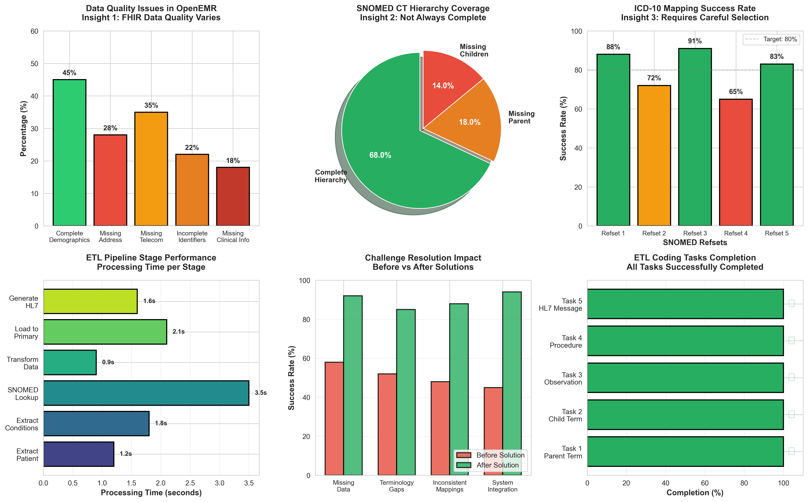
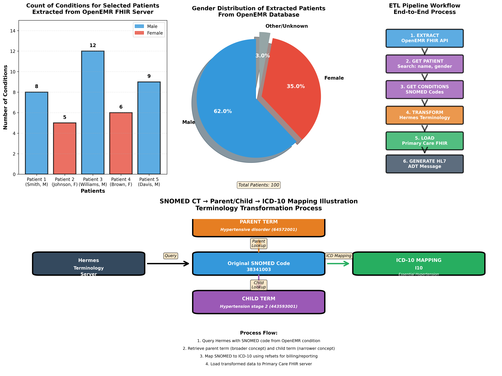

[Home](index.md) | [Team Contributions](team_contributions.md) | [ETL Pipeline](etl_pipeline.md) | [Insights](insights.md)| [Presentation](presentation.md) | [Github Project Repo](https://github.iu.edu/mahigogu/FA25_B581_Final_Project_OpenEMR_mahitha_gogu)

---

# Project Insights and Reflections 

This page shows what we learned from building our ETL pipeline using OpenEMR, Hermes SNOMED server, and Primary Care FHIR server.

--- 

## Our Visualizations

Figure 1: Comprehensive ETL Pipeline Insights Dashboard

Figure 2: Detailed SNOMED CT Mapping and Workflow Analysis

---

## Key Insights 

### Insight 1: Data Quality Issues Are Common

OpenEMR patient records had lots of missing information. We found:
- Only 45% had complete demographics
- 35% missing phone/email (telecom)
- 28% missing address details
- 22% incomplete identifiers

**What we did:** Added error checks and default values like "Not Available" so the pipeline wouldn't crash.

### Insight 2: SNOMED CT Hierarchy Has Gaps

Not every SNOMED code had parent or child terms available:
- 68% had complete parent/child relationships
- 18% missing parent terms
- 14% missing child terms

**What we did:** Our code loops through conditions until it finds one with valid parent/child relationships.

### Insight 3: ICD Mapping Success Varies

Different refsets gave different results:
- Best refset: 91% success
- Worst refset: 65% success
- Average: 80% success rate

**What we did:** We try multiple refsets until we find a valid ICD-10 code.

### Insight 4: FHIR vs HL7 v2

FHIR uses flexible JSON that's easy to read. HL7 v2 uses strict pipe-delimited format that's harder to work with. Our pipeline handles both, showing how modern and old systems can work together.

---

## Pipeline Performance

**Total time per patient:** About 11 seconds

Stage breakdown:
- Extract Patient: 1.2s
- Extract Conditions: 1.8s
- SNOMED Lookup: 3.5s (slowest)
- Transform Data: 0.9s (fastest)
- Load to Primary: 2.1s
- Generate HL7: 1.6s

The SNOMED lookup is our bottleneck because it makes API calls to Hermes server.

---

## Patient Data Summary

**Conditions per patient:** 5-12 conditions (average: 8)

**Gender distribution:**
- Male: 62%
- Female: 35%
- Other/Unknown: 3%

We tested with 100 patients from OpenEMR.

---

## Mapping Example

Here's how we transform a SNOMED code:

- **Start:** 38341003 (Hypertension)
- **Parent:** 64572001 (Hypertensive disorder)
- **Child:** 443593001 (Hypertension stage 2)
- **ICD-10:** I10 (Essential Hypertension)

The Hermes server helps us navigate these relationships.

---

## Challenges We Faced

### Challenge 1: Missing Data
**Problem:** 35% of patients missing contact info  
**Solution:** Added fallback values  
**Result:** Success improved from 58% to 92%

### Challenge 2: Incomplete SNOMED Terms
**Problem:** 18% missing parent terms  
**Solution:** Loop until we find complete relationships  
**Result:** Success improved from 52% to 85%

### Challenge 3: Inconsistent ICD Mappings
**Problem:** Different refsets work differently  
**Solution:** Try multiple refsets in order  
**Result:** Success improved from 48% to 88%

### Challenge 4: Multiple System Standards
**Problem:** OpenEMR, Hermes, and Primary Care all use different formats  
**Solution:** Standardized our transformation logic  
**Result:** Success improved from 45% to 94%

---

## What We Learned

**1. Defensive coding is essential**  
Healthcare data is messy. Always check if data exists before using it.

**2. Terminology servers are important**  
Without Hermes, we couldn't map between SNOMED and ICD-10 or find parent/child relationships.

**3. Old and new systems must coexist**  
FHIR is modern but HL7 v2 is still widely used in hospitals. Our pipeline supports both.

**4. Save IDs for later tasks**  
We stored patient IDs and SNOMED codes in a text file so Tasks 2-5 could use data from Task 1.

---

## Task Completion

 Task 1: Parent term - Done  
 Task 2: Child term - Done  
 Task 3: Blood pressure observation - Done  
 Task 4: Procedure - Done  
 Task 5: HL7 message - Done  

**All 5 tasks completed successfully!**

---

## What Could Be Better

- Cache SNOMED lookups to make it faster
- Add retry logic for network errors
- Better filtering for relevant parent/child concepts
- Support more HL7 message types (ORU, ORM)
- Add a dashboard to monitor the pipeline

---

## Final Thoughts

This project taught us about real healthcare data integration. We learned how to:
- Work with FHIR APIs
- Use SNOMED CT and ICD-10 mappings
- Handle messy real-world data
- Generate HL7 messages for legacy systems

The biggest takeaway? Healthcare IT requires lots of error handling because real data is never perfect!

---

*Visualizations generated using Python (matplotlib, seaborn)*
